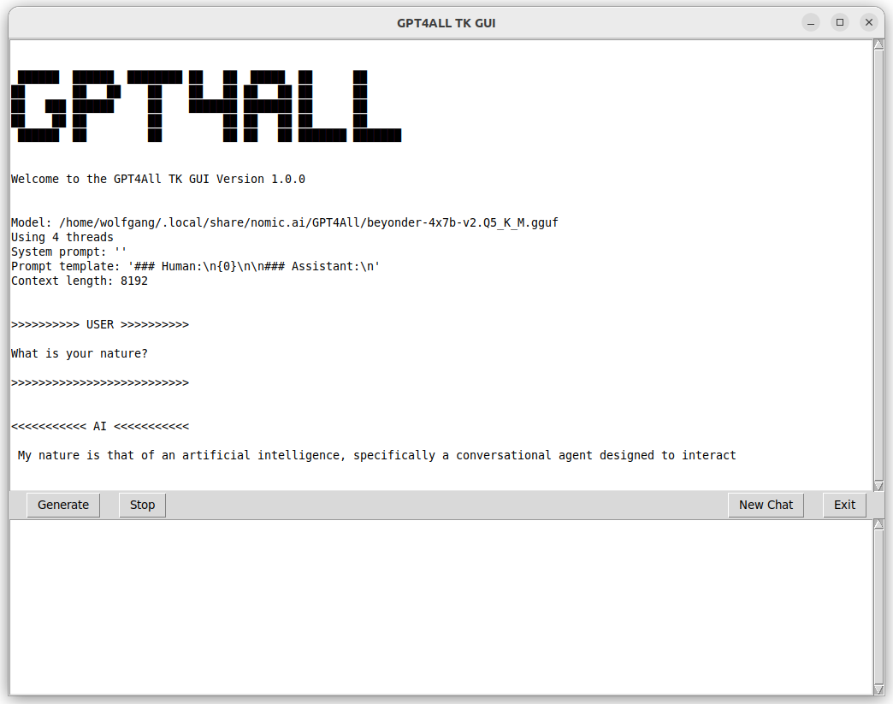

# GPT4All TK CHAT GUI

## Quickstart

The TK GUI is based on the `gpt4all` Python bindings and the `typer` and `tkinter` package.

The following shows one way to get started with the GUI.
Typically, you will want to replace `python` with `python3` on _Unix-like_ systems. 
Also, it's assumed you have all the necessary Python components already installed.

The GUI is a self-contained Python script named `appGUI.py`. As long as
its package dependencies are present, you can download and run it from wherever you like.

```shell
# pip-install the necessary packages;
python -m pip install --upgrade gpt4all typer tkinter
```
Specify the path to the model with the `-m`/`--model` argument and an optional prompt template with `-p`/`--prompt`. 
A system prompt can also be set with `-s`/`--sysprompt`.
Context length defaults to 2048, it can be set with `-c`/`--context-length`

```shell
python appGUI.py --model /home/user/my-gpt4all-models/gpt4all-13b-snoozy-q4_0.gguf --prompt 'Human: {0} Assistant: '

(or --prompt $'Human:\n{0}\n Assistant:\n' with line breaks)
```
Input your request in the bottom window and click "Generate".

 
Inference can be interrupted using the `Space` key.


